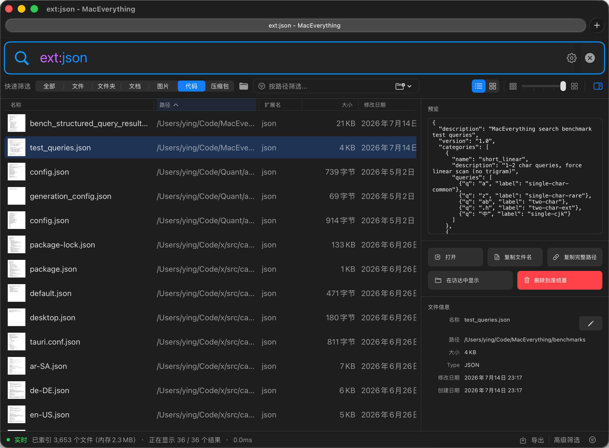

<p align="center">
  
</p>

<h1 align="center">MacEverything</h1>

<p align="center">当前版本：1.7.25 · Fork 自 <a href="https://github.com/joshua-wu/MacEverything">joshua-wu/MacEverything</a></p>

<p align="center">
  <b>macOS 极速文件搜索工具</b> — 在数百万文件中毫秒级定位任意文件。<br/>
  灵感源自 Windows 上的 <a href="https://www.voidtools.com/">Everything</a>，Mac 上无出其右。
</p>

<p align="center">
  <b>中文</b> | <a href="README_EN.md">English</a>
</p>

<p align="center">
  <a href="#安装"></a>
  <a href="LICENSE"></a>
  <a href="#测试体系"></a>
  <a href="#ai-工具集成-mcp"></a>
</p>

---

<p align="center">
  
</p>

## 功能亮点

### 极速搜索

在测试机上索引 **500 万+ 文件约需 14 秒**。常见 Trigram 查询通常在 **0.1–5ms** 内返回；短关键词、复杂正则、结构化路径和冷缓存查询可能需要数十毫秒或更久，详见[基准测试记录](docs/benchmark/README.md)。

| 对比项 | MacEverything | Spotlight | `find` |
|--------|:---:|:---:|:---:|
| 索引 500 万文件 | ~14 秒 | 数分钟以上 | 无索引 |
| 常见文件名查询 | **0.1–5ms** | 200ms–2s | 5–30s |
| 实时文件监控 | FSEvents | FSEvents | 无 |
| 内容搜索 | Trigram 索引 | 侧重元数据 | `grep` |
| AI 工具集成 | 内置 MCP | 不支持 | 不支持 |

### 随叫随到

按 **`Option+Space`** 随时唤出搜索窗口（快捷键可自定义），搜索栏自动获得焦点 — 唤起即输入，搜完即走。支持开机自启（最小化后台运行），不打扰你的工作流。

### 智能输入体验

- **Ghost 文本自动补全** — 输入时自动显示半透明建议文字，来自搜索历史（按频率排序）或系统关键词（如输入 `ex` 提示 `ext:`）。按 **Tab** 一键接受
- **搜索栏语法高亮** — 实时彩色标注：过滤器名紫色、参数蓝色、引号字符串橙色、运算符红色
- **搜索选项徽章** — 搜索栏旁的彩色徽章，一键切换 Regex / Case Sensitive / Whole Word / Match Filename
- **中英文界面** — 应用界面、菜单、设置窗口和搜索语法帮助支持简体中文与英文，跟随 macOS 首选语言自动切换

### [Everything](https://www.voidtools.com/) 风格查询语法

完整的 AST 解析器，支持 15+ 过滤器、布尔运算、glob 通配符、正则表达式。内置语法帮助窗口（**Cmd+?**）。

| 查询 | 说明 |
|------|------|
| `readme` | 文件名或路径包含 "readme" |
| `*.swift` | 所有 Swift 源文件 |
| `ext:py size:>1mb` | 大于 1MB 的 Python 文件 |
| `dm:today` | 今天修改过的文件 |
| `report pdf` | 同时匹配路径/文件名片段，如 `/Users/username/reports/xx.pdf` |
| `config path:/usr` | `/usr` 下包含 "config" 的文件 |
| `"exact phrase"` | 精确短语匹配 |
| `foo OR bar` | 布尔 OR 运算 |
| `case:Makefile` | 区分大小写搜索 |
| `regex:^test_.*\.py$` | 正则表达式搜索 |
| `type:folder node_modules` | 仅搜索目录 |
| `~/Documents/*.pdf` | Tilde 展开 + glob |
| `infile:TODO ext:cpp` | C++ 文件中搜索 "TODO" |

#### 文件名与路径片段匹配

默认搜索面向文件名和完整路径：空格分隔的多个普通词按 AND 组合，每个词可以命中文件名或路径任意位置。因此 `report pdf` 可以匹配 `/Users/username/reports/xx.pdf`，也保留 [Everything](https://www.voidtools.com/) 式“随手输入片段即可命中”的体验。

带 `/` 的查询会启用结构化路径匹配，并继续保持子串匹配语义。比如 `src/main` 表示文件名包含 `main` 且父路径包含 `src`；`/project/*/target` 可匹配非相邻路径段；`/local/bin/*` 用于列出目录的直接子项。非 ASCII 查询会在查询阶段自动尝试 macOS 常见的 Unicode NFC/NFD 归一化，不额外扩大持久索引。

<details>
<summary><b>全部过滤器列表</b></summary>

| 过滤器 | 说明 | 示例 |
|--------|------|------|
| `ext:` | 文件扩展名 | `ext:swift,h` |
| `size:` | 文件大小 | `size:>1mb`, `size:100kb-5mb` |
| `type:` | 文件/目录 | `type:folder` |
| `path:` | 路径包含 | `path:Downloads` |
| `nopath:` | 路径排除 | `nopath:node_modules` |
| `parent:` | 直接父目录 | `parent:src` |
| `depth:` | 目录深度 | `depth:<3` |
| `dm:` | 修改日期 | `dm:today`, `dm:>2024-01-01` |
| `dc:` | 创建日期 | `dc:thisweek` |
| `da:` | 访问日期 | `da:last7days` |
| `len:` | 文件名长度 | `len:>50` |
| `case:` | 区分大小写 | `case:README` |
| `regex:` | 正则表达式 | `regex:^test_` |
| `ww:` | 全词匹配 | `ww:test` |
| `wfn:` | 全文件名匹配 | `wfn:Makefile` |
| `content:` / `infile:` | 内容搜索 | `infile:TODO` |
| `audio:` `video:` `pic:` `doc:` `zip:` | 文件类型宏 | `audio:` = 所有音频文件 |

</details>

### 全文内容搜索

输入 `infile:关键词` 搜索文件内容，结果附带关键词高亮上下文片段。基于 Trigram 索引加速，仅重新索引变更文件。可在「内容设置」中配置索引的文件类型和最大文件大小。

### 实时同步，永不过时

- **文件监控** — 基于 FSEvents 实时监听文件系统变更，新建、重命名、删除的文件立即出现在搜索结果中
- **USB 热插拔** — 插入 USB 设备后自动扫描并索引新文件，拔出后自动清理索引，无需重启应用
- **两阶段即时启动** — 启动时先加载磁盘缓存（立即可搜），后台通过 FSEvents 增量追赶变更，搜索零等待
- **焦点感知省电** — 窗口不在前台时暂停刷新，回到前台时批量追赶，几乎零后台 CPU 占用

### 交互细节

- **智能高亮** — 搜索结果中匹配部分高亮标记，基于 AST 感知：正确处理 glob 通配符、正则、大小写、NOT 排除等复杂场景
- **快速过滤器** — 结果列表上方可一键筛选文件、文件夹、文档、图片、代码和压缩包；当过滤器导致当前查询无结果时自动回到全部结果，避免误以为搜索失败
- **路径过滤器** — 可在当前搜索结果内继续按路径片段过滤，适合在大结果集中快速缩小目录范围
- **常用目录切换** — 路径过滤器可直接选择文件夹，并保留最近使用的 5 个目录
- **结果导出** — 将查询结果上限内的完整结果集导出为 CSV 或 TXT，不受 GUI 分页影响；文件名搜索上限默认为 10,000、最多 100,000，内容搜索默认且最多 200（可单独调低）
- **高级筛选** — 窗口底部状态栏右侧提供带文字标识的高级筛选入口，可按文件大小和修改日期筛选，支持常用预设与自定义范围
- **可配置结果列** — 支持按名称、扩展名、路径、大小、修改日期排序，扩展名/路径/大小/日期列可显示或隐藏，列宽可拖拽调整
- **列表与图标模式** — 快速筛选栏右侧以“显示方式”明确标识布局控件；5 档等比缩略图滑块始终保持显示，在列表模式或无结果时置灰
- **可调结果外观** — 列表缩略图默认开启，可将列表结果调整得更紧凑或更舒展；颜色编辑器会自动选中当前生效的浅色或深色模式
- **拖放** — 直接从搜索结果拖放文件到 Finder、VS Code、Xcode 等任意应用
- **键盘与右键操作** — Enter 可配置为打开文件或重命名；支持方向键选择、结果列表聚焦、右键打开 / 在 Finder 中显示 / 复制完整路径
- **Cmd+Click** — 快速在 Finder 中定位文件
- **最近文件** — 搜索栏为空时自动展示最近修改的文件

### AI 工具集成 (MCP)

内置 [Model Context Protocol](https://modelcontextprotocol.io/) 服务器，让 AI 编程工具即时搜索你的文件系统。在菜单栏或设置中一键开启，支持 **Codex**、**Claude Code**、**Cursor** 和 **Claude Desktop**。

```
Codex / Claude Code / Cursor / Claude Desktop
       │
       ▼  (stdio JSON-RPC 2.0)
  MacEverythingMCP
       │
       ▼  (HTTP localhost:19860)
  MacEverything.app
```

MacEverything 按各客户端当前的全局配置方式进行注册：Codex 使用 `codex mcp` 管理 `~/.codex/config.toml`，Claude Code 使用用户级 `claude mcp` 配置，Cursor 写入 `~/.cursor/mcp.json`，Claude Desktop 写入其应用支持目录中的配置文件。配置后请重新启动对应客户端或开启一个新会话。

| 工具 | 说明 |
|------|------|
| `search_files` | 文件名搜索（Trigram 加速） |
| `search_content` | 全文内容搜索 |
| `recent_files` | 最近修改的文件 |
| `index_status` | 索引统计与健康状态 |

### HTTP API

本地 REST API 监听 `localhost:19860`，方便脚本调用和自动化：

```bash
curl "http://localhost:19860/api/search?q=readme&limit=10" # 搜索文件
curl "http://localhost:19860/api/search/content?q=TODO"    # 内容搜索
curl "http://localhost:19860/api/recent?limit=20"          # 最近文件
curl "http://localhost:19860/api/status"                   # 索引状态
curl "http://localhost:19860/api/memory"                   # 内存拆分
```

访问 token 默认关闭，方便本机脚本直接调用。可在设置中开启并编辑或重新生成 token；开启后，除 `/api/health` 外均需从 `~/Library/Application Support/com.maceverything.app/.http_token` 读取 token 并发送 `Authorization: Bearer <token>`。HTTP 服务始终只绑定本机回环地址，并校验 Host、拒绝浏览器 Origin 请求。

### 命令行客户端

Release 应用内置短命令 `mace`，用于查询正在运行的 MacEverything：

```bash
mace readme                 # 文件名搜索，默认逐行输出完整路径
mace -c "TODO fix"          # 全文内容搜索
mace -r -n 20              # 最近修改的 20 个文件
mace -s                    # 索引状态
mace -j readme             # 保留完整 JSON 响应
mace -0 readme | xargs -0  # NUL 分隔，安全处理带空格的路径
```

`mace` 默认读取 MacEverything 设置中的 HTTP 端口；只有需要临时连接其他端口时才需使用 `--port`。

不安装 Homebrew 也可以把应用内的可执行文件链接到个人命令目录：

```bash
mkdir -p ~/.local/bin
ln -sf /Applications/MacEverything.app/Contents/MacOS/mace ~/.local/bin/mace
```

确保 `~/.local/bin` 在 `PATH` 中。也可以直接运行 `/Applications/MacEverything.app/Contents/MacOS/mace`。

### 安装

#### 发布状态与下载

当前稳定版本为 **1.7.25**。

使用 Homebrew Cask 安装或升级：

```bash
brew tap ying-zhang/maceverything
brew install --cask maceverything
# 后续升级：brew upgrade --cask maceverything
```

也可以从 [Releases](https://github.com/ying-zhang/MacEverything/releases) 下载对应架构的 DMG：

1. Apple Silicon 选择 `MacEverything-arm64.dmg`，Intel 选择 `MacEverything-x86_64.dmg`
2. 将 `MacEverything.app` 拖入「应用程序」文件夹
3. 首次启动选择 **快速开始**（仅所选文件夹）或 **全盘搜索**（需要完全磁盘访问权限）
4. 等待初始扫描完成（约 14 秒）
5. 按 `Option+Space` 开始搜索

#### 从源码构建

**环境要求：** macOS 15+、Xcode 16+（完整 Xcode，不只是 Command Line Tools），以及 RE2/Abseil 头文件和目标架构动态库。Homebrew 不是必需依赖。

不使用 Homebrew 时，可先安装官方发布版 MacEverything，再从应用包复用已经验证过的 arm64 动态库；脚本会从 Google 官方仓库下载与动态库匹配的 RE2 `2025-11-05` 和 Abseil `20260107.1` 头文件：

```bash
scripts/prepare-re2-deps-from-app.sh
```

依赖会放入 Git 忽略的 `third_party/re2/`。也可以把应用路径和输出目录显式传给脚本：

```bash
scripts/prepare-re2-deps-from-app.sh /Applications/MacEverything.app third_party/re2
```

如已通过其他方式准备 RE2/Abseil，可使用 `RE2_SOURCE_DIR`、`ABSEIL_SOURCE_DIR`、`RE2_LIB_DIR` 和 `ABSEIL_LIB_DIR` 调用 `scripts/prepare-re2-deps.sh`。Homebrew 仍可作为可选的依赖来源，但不参与默认本地构建流程。

```bash
git clone https://github.com/ying-zhang/MacEverything.git && cd MacEverything
scripts/prepare-re2-deps-from-app.sh
make test-fast
scripts/build-release-dmgs.sh arm64
```

Release 构建和 GitHub Actions 发布包会自动把 `libre2` 及其实际使用的 Abseil 依赖闭包嵌入 `.app/Contents/Frameworks`，避免发布包依赖开发机环境。发布脚本会验证主应用、MCP、`mace` 和内嵌 dylib 的架构与依赖路径；最终 arm64 DMG 位于 `artifacts/MacEverything-arm64.dmg`。

<h2 align="center">开发者篇：技术深度</h2>

<p align="center">
  以下内容面向对实现细节感兴趣的开发者。
</p>

### 架构总览

```
┌─────────────────────────────────────┐
│       SwiftUI 应用层                │  界面 · ViewModel · MVVM
├─────────────────────────────────────┤
│    Objective-C++ 桥接层             │  零开销互操作
├─────────────────────────────────────┤
│       C++20 核心引擎                │  扫盘 · 索引 · 搜索 · 持久化
└─────────────────────────────────────┘
```

同一套 C++20 核心引擎支持三种使用模式：

| 模式 | 说明 |
|------|------|
| **GUI 应用** | SwiftUI 菜单栏应用，`Option+Space` 全局快捷键 |
| **CLI 客户端** | 短命令 `mace` — 查询正在运行的 GUI 应用 |
| **MCP 服务器** | `MacEverythingMCP` — stdio JSON-RPC 代理，供 AI 工具调用 |

### 核心引擎

| 组件 | 关键设计 |
|------|---------|
| **DirectoryScanner** | 多线程工作窃取 + `getattrlistbulk` 单次系统调用批量获取文件属性，4–32 线程自适应 |
| **SearchEngine** | Trigram 倒排索引（name + path 双索引）+ 多词路径/文件名候选合并 + 竞争选择最优候选集 + SoA 列式过滤 |
| **ContentIndex** | Trigram 全文倒排索引，FNV-1a 哈希增量更新，仅重新索引变更文件 |
| **SIMDSearch** | ARM NEON 128-bit first-last byte 向量化匹配 + 2x 循环展开，单线程 11.5 GB/s |
| **IndexPersistence** | WAL + CRC32 + 分页脏页刷写 + 原子 rename，COW 无阻塞压缩（锁持有 < 100ms） |
| **FileSystemWatcher** | FSEvents + eventId 增量回放 + 日志截断检测自动子树重扫 |
| **PathTable** | 路径字符串 intern 化 — 目录路径仅存 `uint32` 索引，百万文件节省 ~550MB |
| **QueryParser** | 完整 AST 管线：Tokenizer → FilterParser → Parser → QueryAST，30+ 过滤器关键词 |

### 基准测试

测试环境：macOS Darwin 24.3.0，**540 万索引文件**，48 种查询类型：

#### 搜索延迟

| 查询类型 | 平均延迟 | 示例 |
|----------|:---------:|------|
| 长关键词 (7+ 字符) | **0.1–1ms** | `screenshot` 0.1ms, `dockerfile` 0.1ms |
| 中等关键词 (4–6 字符) | **1–5ms** | `readme` 1.2ms, `config` 4.7ms |
| Glob 模式 | **0.7–18ms** | `*.cpp` 0.7ms, `*.swift` 1.5ms |
| 路径查询 | **3–32ms** | `package.json` 2.9ms |
| 全部 48 种查询 (均值) | **10.5ms** | SoA 优化后最新结果 |

#### Trigram vs 线性扫描

| 查询 | Trigram | 线性扫描 | 加速比 |
|------|:------:|:------:|:------:|
| `node_modules` | 0.5ms | 154ms | **308x** |
| `application` | 2.1ms | 175ms | **83x** |
| `readme` | 1.2ms | 49ms | **41x** |

#### SIMD 字符串搜索 (Apple M3 Pro)

| 方法 | 吞吐量 | 对比 `std::string::find` |
|------|:------:|:------------------------:|
| `std::string::find` | 1.2 GB/s | 基准线 |
| **NEON 128-bit（单线程）** | **11.5 GB/s** | **9.5x** |
| **NEON 128-bit（12 线程）** | **74.3 GB/s** | **60.7x** |

### 关键技术

| 技术 | 效果 |
|------|------|
| `getattrlistbulk` | 单次系统调用批量获取文件属性 — 避免逐文件 `stat` |
| Trigram 倒排索引 | 亚线性搜索：比线性扫描快 33x–308x |
| 文件名/路径双索引 | 普通词同时检索文件名与完整路径，复用现有 Trigram 和 PathTable，不增加内容索引级别的磁盘占用 |
| SoA 列式布局 | 缓存友好的内存访问模式，纯过滤查询 SIMD 批量判断 16 条记录 |
| `__builtin_prefetch` | 预取距离 8，隐藏候选验证阶段的随机内存访问延迟 |
| ARM NEON SIMD | 128-bit 向量化字符串匹配，2x 循环展开，逼近内存带宽上限 |
| GCD 并行扫描 | Trigram 无法加速时启用多核线性扫描 |
| StringPool 连续内存 | 文件名紧凑排列在单一 `char` 缓冲区，SIMD 友好 |
| PathTable intern 化 | 目录路径仅存 `uint32` 索引 — 百万文件节省 ~550MB |
| v6 Flat SoA 两阶段加载 | 启动时先装载基础记录立即可搜，后台构建 Trigram、拼音、路径、扩展名、CJK bigram 和最近文件索引 |
| Phase 2 索引可靠性保护 | 后台索引构建期间新增/更新记录先写入基础数据，索引完成时统一回放；内存不足时跳过 Phase 2，避免半成品索引 |
| Unicode 查询归一化 | 对非 ASCII 查询在查询阶段尝试 NFC/NFD 变体，兼容 macOS 文件名表示且不维护第二份索引 |
| Generation 计数器 | 每 1024 次迭代检查，快速输入时零开销取消过时查询 |
| APFS Firmlink 去重 | inode + devid 检测，正确处理 macOS Data/System 卷合并环路 |
| Regex Trigram 预过滤 | 从正则中提取字面量生成 trigram 候选，~7s → <100ms |
| CJK bigram 索引 | 中文、日文、韩文查询可通过 bigram 候选集预过滤，降低纯线性扫描概率 |
| 自适应 Trigram 旁路 | 候选集过大时自动回退并行扫描，避免无效索引查找 |
| FSEvents 安全重放 | 规范化排除路径、过滤自身缓存事件，停止监听时排空回调队列，避免竞态与误触发全量重扫 |
| USB 热插拔索引维护 | `willUnmount` 预清理 + `didMount` 自动重扫 + `config_` shared_mutex 线程安全 + FSEvents 自动重启 |
| 多词组合评分 | 按 miss count（文件名未命中词数）+ match quality（精确/前缀/词界/子串）+ 路径长度三级排序，多词查询结果更精准 |
| COW 无阻塞压缩 | 写时复制，压缩期间独占锁持有 < 100ms（原 30–60s） |
| 分页增量持久化 | 仅写入脏页，典型 flush I/O 从 ~112MB 降至 KB 级 |

### 测试体系

87 个 C++ 测试模块覆盖完整技术栈，另有 Swift 测试，支持 AddressSanitizer 和 ThreadSanitizer：

```bash
make test          # 快速单元测试 + 桥接层 lint
make test-slow     # 集成测试（全盘扫描、FSEvents、端到端）
make test-all      # 全部测试
make test-asan     # AddressSanitizer
make test-tsan     # ThreadSanitizer
```

覆盖范围：
- **核心引擎**：扫描、查询、变更、压缩、排序、路径搜索
- **持久化**：WAL CRC 完整性、批量回放、竞态条件、分页持久化 v5
- **内容索引**：Trigram、压缩、修改时间跟踪、WAL 跟踪
- **搜索/查询**：分词器、解析器、过滤器、日期过滤、结构化查询、正则 Trigram、高亮提示
- **性能**：SIMD 搜索、千万条记录合成基准、Trigram 竞争测试
- **集成**：线程安全、端到端、HTTP 引擎热替换、MCP 协议
- **内存安全**：ASan + TSan 构建

### 项目结构

```
MacEverything/
├── Core/                  # C++20 核心引擎
│   ├── SearchEngine       # Trigram 索引 + 并行查询（5 个 .cpp 文件）
│   ├── DirectoryScanner   # 多线程批量扫描器
│   ├── ContentIndex       # 全文倒排索引
│   ├── IndexPersistence   # WAL + 分页持久化
│   ├── FileSystemWatcher  # FSEvents 实时监控
│   ├── HttpServer         # 内嵌 REST API 服务器
│   ├── SIMDSearch         # ARM NEON 向量化搜索
│   ├── QueryAST/Parser    # 完整查询语言管线
│   ├── PathTable          # 字符串 intern 表
│   └── ServiceEngine      # 生命周期编排
├── Bridge/                # Objective-C++ 桥接层
│   └── MacSearchBridge    # C++ ↔ Swift 零开销互操作
├── App/                   # SwiftUI 应用层
│   ├── ContentView        # 主搜索界面
│   ├── SearchViewModel    # MVVM + 分级防抖
│   ├── HotkeyManager      # 全局快捷键注册
│   └── MCPConfigManager   # MCP 一键配置
├── CLI/                   # 命令行工具
│   ├── mace_main          # 短命令查询客户端
│   └── mcp_main           # MCP 服务器（stdio JSON-RPC）
└── tests/                 # 87 个 C++ 测试模块及 Swift 测试
```

## 参与贡献

欢迎贡献代码！请遵循以下流程：

1. Fork 本仓库
2. 创建功能分支 (`feat/...`) 或修复分支 (`fix/...`)
3. 为新功能编写测试
4. 确保 `make test-all` 通过
5. 提交 Pull Request

## 许可证

本项目基于 MIT 许可证开源 — 详见 [LICENSE](LICENSE) 文件。

---

<p align="center">
  <b>如果 MacEverything 让你找文件更快了，请给一颗 Star 支持！</b>
</p>
