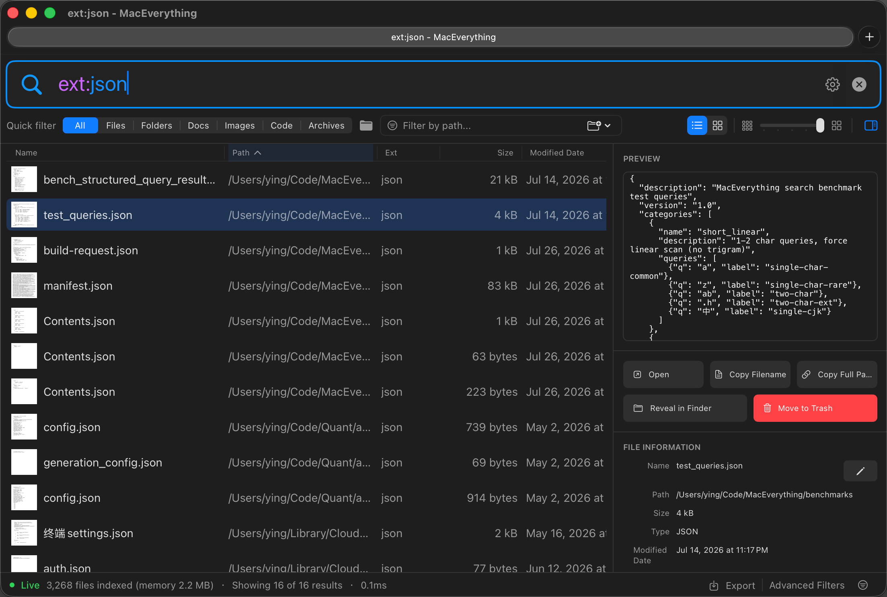

<p align="center">
  
</p>

<h1 align="center">MacEverything</h1>

<p align="center">Current version: 1.7.50 · Forked from <a href="https://github.com/joshua-wu/MacEverything">joshua-wu/MacEverything</a></p>

<p align="center">
  <b>Instant file search for macOS</b> — find any file among millions in milliseconds.<br/>
  Inspired by <a href="https://www.voidtools.com/">Everything</a> on Windows. Nothing else comes close on Mac.
</p>

<p align="center">
  <a href="README.md">中文</a> | <b>English</b>
</p>

<p align="center">
  <a href="#installation"></a>
  <a href="LICENSE"></a>
  <a href="#testing"></a>
  <a href="#ai-tool-integration-mcp"></a>
</p>

---

<p align="center">
  
</p>

## Feature Highlights

### Blazing Fast Search

On the reference machine, indexing **5 million+ files takes about 14 seconds**. Common trigram queries usually return in **0.1–5ms**; short terms, complex regexes, structured paths, and cold-cache queries can take tens of milliseconds or longer. See the [benchmark history](docs/benchmark/README.md).

| Comparison | MacEverything | Spotlight | `find` |
|------------|:---:|:---:|:---:|
| Index 5M files | ~14s | Minutes+ | No index |
| Common filename query | **0.1–5ms** | 200ms–2s | 5–30s |
| Real-time monitoring | FSEvents | FSEvents | None |
| Content search | Trigram index | Metadata-heavy | `grep` |
| AI tool integration | Built-in MCP | No | No |

### Always at Your Fingertips

Press **`Option+Space`** to summon the search window anytime (hotkey is customizable). The search bar auto-focuses — start typing immediately, find what you need, and move on. Supports launch-at-login with minimized background mode, staying out of your workflow.

### Smart Input Experience

- **Ghost text autocomplete** — semi-transparent suggestions appear as you type, drawn from search history (sorted by frequency) or system keywords (e.g., typing `ex` suggests `ext:`). Press **Tab** to accept
- **Search bar syntax highlighting** — real-time color coding: filter names in purple, arguments in blue, quoted strings in orange, operators in red
- **Search option badges** — colorful badges next to the search bar for one-click toggling of Regex / Case Sensitive / Whole Word / Match Filename
- **Chinese and English UI** — the app UI, menus, settings windows, and search syntax help support Simplified Chinese and English, automatically following the preferred macOS language

### [Everything](https://www.voidtools.com/)-Style Query Syntax

Full AST parser supporting 15+ filters, boolean operators, glob wildcards, and regular expressions. Built-in syntax help window (**Cmd+?**).

| Query | Description |
|-------|-------------|
| `readme` | Files containing "readme" in the name or path |
| `*.swift` | All Swift source files |
| `ext:py size:>1mb` | Python files larger than 1MB |
| `dm:today` | Files modified today |
| `report pdf` | Match path/name fragments together, such as `/Users/username/reports/xx.pdf` |
| `config path:/usr` | Files containing "config" under `/usr` |
| `"exact phrase"` | Exact phrase matching |
| `foo OR bar` | Boolean OR operation |
| `case:Makefile` | Case-sensitive search |
| `regex:^test_.*\.py$` | Regular expression search |
| `type:folder node_modules` | Search directories only |
| `~/Documents/*.pdf` | Tilde expansion + glob |
| `infile:TODO ext:cpp` | Search "TODO" inside C++ files |

#### Filename and Path Fragment Matching

Default search targets both filenames and full paths: multiple plain terms separated by spaces are combined with AND, and each term may match anywhere in the filename or path. For example, `report pdf` can match `/Users/username/reports/xx.pdf`, preserving the [Everything](https://www.voidtools.com/)-style experience where casual fragments still find files.

Queries containing `/` enable structured path matching while keeping substring semantics. For example, `src/main` means the filename contains `main` and the parent path contains `src`; `/project/*/target` can match non-adjacent path segments; `/local/bin/*` lists direct children of a directory. For non-ASCII queries, MacEverything tries common macOS Unicode NFC/NFD normalization variants at query time, without growing the persistent index.

<details>
<summary><b>Full filter list</b></summary>

| Filter | Description | Example |
|--------|-------------|---------|
| `ext:` | File extension | `ext:swift,h` |
| `size:` | File size | `size:>1mb`, `size:100kb-5mb` |
| `type:` | File/folder | `type:folder` |
| `path:` | Path contains | `path:Downloads` |
| `nopath:` | Path excludes | `nopath:node_modules` |
| `parent:` | Direct parent directory | `parent:src` |
| `depth:` | Directory depth | `depth:<3` |
| `dm:` | Date modified | `dm:today`, `dm:>2024-01-01` |
| `dc:` | Date created | `dc:thisweek` |
| `da:` | Date accessed | `da:last7days` |
| `len:` | Filename length | `len:>50` |
| `case:` | Case-sensitive | `case:README` |
| `regex:` | Regular expression | `regex:^test_` |
| `ww:` | Whole word match | `ww:test` |
| `wfn:` | Whole filename match | `wfn:Makefile` |
| `content:` / `infile:` | Content search | `infile:TODO` |
| `audio:` `video:` `pic:` `doc:` `zip:` | File type macros | `audio:` = all audio files |

</details>

### Full-Text Content Search

Type `infile:keyword` to search file contents — results include highlighted context snippets around the keyword. Powered by a Trigram index for speed, only re-indexing changed files. Configure indexed file types and max file size in Content Settings.

### Real-Time Sync, Always Up to Date

- **File monitoring** — FSEvents-based real-time file system listener; new, renamed, or deleted files appear in search results immediately
- **USB hot-plug** — automatically scans and indexes files on newly inserted USB drives, and cleans up the index on ejection — no restart needed
- **Two-phase instant startup** — loads disk cache on launch (searchable immediately), then catches up with changes via FSEvents in the background. Zero wait time
- **Focus-aware power saving** — pauses refresh when the window is in the background, batch-catches up on refocus. Near-zero background CPU usage

### Interaction Details

- **Smart highlighting** — matches highlighted in search results, AST-aware: correctly handles glob wildcards, regex, case sensitivity, NOT exclusions, and other complex patterns
- **Quick filters** — filter the current result set by files, folders, documents, images, code, or archives; if a selected filter makes the current query empty, MacEverything falls back to all results so the search does not look broken
- **Path filter** — narrow the current result set by a path fragment, useful when a broad query spans many directories
- **Recent folders** — choose a folder directly from the path filter and reuse or remove any of the five most recent folders
- **Result export** — export every result within the configured query limit as CSV or TXT, independent of GUI pagination; filename search defaults to 10,000 and supports up to 100,000, while content search has a separate configurable limit capped at 200
- **Advanced filters** — a labeled entry on the right side of the bottom status bar filters by file size and modified date, with common presets and custom ranges
- **Configurable result columns** — sort by name, extension, path, size, or modified date; extension/path/size/date columns can be shown or hidden, and column widths are resizable
- **List and icon modes** — the labeled view controls sit on the right side of the vertically centered quick-filter bar; the five-level aspect-preserving thumbnail slider stays visible and is disabled in list mode or when there are no results
- **Adjustable result appearance** — list thumbnails are enabled by default, results can be made more compact or spacious, and the color editor automatically selects the active light or dark appearance
- **Drag & drop** — drag files directly from search results to Finder, VS Code, Xcode, or any application
- **Keyboard and context actions** — Enter can open or rename the selected result; supports arrow-key selection, result-list focus, and context actions for Open / Reveal in Finder / Copy Full Path
- **Cmd+Click** — quickly locate files in Finder
- **Recent files** — automatically shows recently modified files when the search bar is empty

### AI Tool Integration (MCP)

Built-in [Model Context Protocol](https://modelcontextprotocol.io/) server — lets AI coding tools instantly search your file system. Enable it from the menu bar or Settings. Supports **Codex**, **Claude Code**, **Cursor**, and **Claude Desktop**.

```
Codex / Claude Code / Cursor / Claude Desktop
       │
       ▼  (stdio JSON-RPC 2.0)
  MacEverythingMCP
       │
       ▼  (HTTP localhost:19860)
  MacEverything.app
```

MacEverything registers with each client's current global configuration mechanism: Codex through `codex mcp` and `~/.codex/config.toml`, Claude Code through user-scoped `claude mcp` configuration, Cursor through `~/.cursor/mcp.json`, and Claude Desktop through its Application Support configuration. Restart the client or open a new session after changing the integration.

| Tool | Description |
|------|-------------|
| `search_files` | Filename search (Trigram-accelerated) |
| `search_content` | Full-text content search |
| `recent_files` | Recently modified files |
| `index_status` | Index statistics & health |

### HTTP API

Local REST API on `localhost:19860` for scripting and automation:

```bash
curl "http://localhost:19860/api/search?q=readme&limit=10" # Search files
curl "http://localhost:19860/api/search/content?q=TODO"    # Content search
curl "http://localhost:19860/api/recent?limit=20"          # Recent files
curl "http://localhost:19860/api/status"                   # Index status
curl "http://localhost:19860/api/memory"                   # Memory breakdown
```

Access-token authentication is off by default for convenient local scripting. Settings can enable it and edit or regenerate the token; once enabled, every endpoint except `/api/health` requires `Authorization: Bearer <token>` using the mode-0600 token file under Application Support. The server always binds to loopback, validates Host, and rejects browser Origin headers.

### Command-Line Client

Release builds include the short `mace` command for querying a running MacEverything app:

```bash
mace readme                 # Filename search; prints one full path per line
mace -c "TODO fix"          # Full-text content search
mace -r -n 20              # 20 most recently modified files
mace -s                    # Index status
mace -j readme             # Preserve the complete JSON response
mace -0 readme | xargs -0  # NUL-delimited paths for safe piping
```

`mace` reads the HTTP port from MacEverything settings by default. Use `--port` only to temporarily connect to another port.

Without Homebrew, link the bundled executable into your personal command directory:

```bash
mkdir -p ~/.local/bin
ln -sf /Applications/MacEverything.app/Contents/MacOS/mace ~/.local/bin/mace
```

Make sure `~/.local/bin` is in `PATH`, or invoke `/Applications/MacEverything.app/Contents/MacOS/mace` directly.

### Installation

#### Release Status and Downloads

The current stable version is **1.7.50**.

Install or upgrade with Homebrew Cask:

```bash
brew tap ying-zhang/maceverything
brew install --cask maceverything
# Later upgrades: brew upgrade --cask maceverything
```

Alternatively, download the appropriate DMG from [Releases](https://github.com/ying-zhang/MacEverything/releases):

1. Choose `MacEverything-arm64.dmg` for Apple Silicon or `MacEverything-x86_64.dmg` for Intel
2. Drag `MacEverything.app` to Applications
3. On first launch choose **Quick Start** (selected folders only) or **Full Disk Search** (requires Full Disk Access)
4. Wait for initial scan (~14 seconds)
5. Press `Option+Space` to start searching

#### Build from Source

**Requirements:** macOS 15+, Xcode 16+ (full Xcode, not just Command Line Tools), plus RE2/Abseil headers and dynamic libraries for the target architecture. Homebrew is not required.

For a Homebrew-free setup, install an official MacEverything release first and reuse the verified arm64 libraries bundled with the app. This script downloads matching RE2 `2025-11-05` and Abseil `20260107.1` headers from the official Google repositories:

```bash
scripts/prepare-re2-deps-from-app.sh
```

Dependencies are placed in the Git-ignored `third_party/re2/` directory. The app and destination paths can also be passed explicitly:

```bash
scripts/prepare-re2-deps-from-app.sh /Applications/MacEverything.app third_party/re2
```

For dependencies prepared another way, call `scripts/prepare-re2-deps.sh` with `RE2_SOURCE_DIR`, `ABSEIL_SOURCE_DIR`, `RE2_LIB_DIR`, and `ABSEIL_LIB_DIR`. Homebrew remains an optional source, but is not part of the default local build workflow.

```bash
git clone https://github.com/ying-zhang/MacEverything.git && cd MacEverything
scripts/prepare-re2-deps-from-app.sh
make test-fast
scripts/build-release-dmgs.sh arm64
```

Release builds and GitHub Actions artifacts embed `libre2` and the Abseil dependency closure it actually uses into `.app/Contents/Frameworks`, so the distributed app does not depend on the development machine. The release script verifies the app, MCP, `mace`, and embedded dylib architectures and dependency paths; the final arm64 DMG is written to `artifacts/MacEverything-arm64.dmg`.

<h2 align="center">For Developers: Technical Deep Dive</h2>

<p align="center">
  The following content is for developers interested in implementation details.
</p>

### Architecture Overview

```
┌─────────────────────────────────────┐
│       SwiftUI App Layer             │  UI · ViewModel · MVVM
├─────────────────────────────────────┤
│    Objective-C++ Bridge Layer       │  Zero-overhead interop
├─────────────────────────────────────┤
│       C++20 Core Engine             │  Scan · Index · Search · Persist
└─────────────────────────────────────┘
```

The same C++20 core engine supports three usage modes:

| Mode | Description |
|------|-------------|
| **GUI App** | SwiftUI menu-bar app, `Option+Space` global hotkey |
| **CLI Client** | Short `mace` command for querying the running GUI app |
| **MCP Server** | `MacEverythingMCP` — stdio JSON-RPC proxy for AI tools |

### Core Engine

| Component | Key Design |
|-----------|-----------|
| **DirectoryScanner** | Multi-threaded work-stealing + `getattrlistbulk` single-syscall bulk attribute reads, 4–32 threads adaptive |
| **SearchEngine** | Trigram inverted index (name + path dual indexes) + multi-term path/name candidate merging + competitive optimal candidate selection + SoA columnar filtering |
| **ContentIndex** | Trigram full-text inverted index, FNV-1a hash incremental updates, only re-indexes changed files |
| **SIMDSearch** | ARM NEON 128-bit first-last byte vectorized matching + 2x loop unrolling, 11.5 GB/s single-thread |
| **IndexPersistence** | WAL + CRC32 + paged dirty-page flushing + atomic rename, COW non-blocking compaction (lock held < 100ms) |
| **FileSystemWatcher** | FSEvents + eventId incremental replay + log truncation detection with automatic subtree rescan |
| **PathTable** | Path string interning — directory paths stored as `uint32` index, saving ~550MB at million-file scale |
| **QueryParser** | Full AST pipeline: Tokenizer → FilterParser → Parser → QueryAST, 30+ filter keywords |

### Benchmarks

Test environment: macOS Darwin 24.3.0, **5.4 million indexed files**, 48 query types:

#### Search Latency

| Query Type | Avg Latency | Example |
|------------|:-----------:|---------|
| Long keywords (7+ chars) | **0.1–1ms** | `screenshot` 0.1ms, `dockerfile` 0.1ms |
| Medium keywords (4–6 chars) | **1–5ms** | `readme` 1.2ms, `config` 4.7ms |
| Glob patterns | **0.7–18ms** | `*.cpp` 0.7ms, `*.swift` 1.5ms |
| Path queries | **3–32ms** | `package.json` 2.9ms |
| All 48 queries (average) | **10.5ms** | Latest results after SoA optimization |

#### Trigram vs Linear Scan

| Query | Trigram | Linear Scan | Speedup |
|-------|:------:|:------:|:------:|
| `node_modules` | 0.5ms | 154ms | **308x** |
| `application` | 2.1ms | 175ms | **83x** |
| `readme` | 1.2ms | 49ms | **41x** |

#### SIMD String Search (Apple M3 Pro)

| Method | Throughput | vs `std::string::find` |
|--------|:---------:|:----------------------:|
| `std::string::find` | 1.2 GB/s | baseline |
| **NEON 128-bit (single-thread)** | **11.5 GB/s** | **9.5x** |
| **NEON 128-bit (12 threads)** | **74.3 GB/s** | **60.7x** |

### Key Technologies

| Technology | Impact |
|------------|--------|
| `getattrlistbulk` | Single syscall for bulk file attributes — avoids per-file `stat` |
| Trigram inverted index | Sub-linear search: 33x–308x faster than linear scan |
| Filename/path dual indexes | Plain terms search both filenames and full paths, reusing the existing Trigram index and PathTable without content-index-scale disk growth |
| SoA columnar layout | Cache-friendly memory access, SIMD batch-checks 16 records for pure filter queries |
| `__builtin_prefetch` | Prefetch distance 8, hides random memory access latency during candidate verification |
| ARM NEON SIMD | 128-bit vectorized string matching, 2x loop unrolling, approaches memory bandwidth ceiling |
| GCD parallel scan | Multi-core linear scan when trigram can't accelerate |
| StringPool contiguous memory | Filenames packed in a single `char` buffer, SIMD-friendly |
| PathTable interning | Directory paths stored as `uint32` index — saves ~550MB at million-file scale |
| v6 Flat SoA two-phase load | Loads base records first so search becomes available quickly, then builds Trigram, pinyin, path, extension, CJK bigram, and recent-file indexes in the background |
| Phase 2 index reliability guard | Records added or updated during background index construction are committed to base data first and replayed when indexes swap in; Phase 2 is skipped under low-memory pressure to avoid partial indexes |
| Unicode query normalization | Tries NFC/NFD variants for non-ASCII queries at query time, matching macOS filename representations without maintaining a second index |
| Generation counter | Checked every 1024 iterations, zero-overhead cancellation of stale queries during fast typing |
| APFS Firmlink dedup | inode + devid detection, correctly handles macOS Data/System volume merge loops |
| Regex Trigram pre-filter | Extracts literals from regex to generate trigram candidates, ~7s → <100ms |
| CJK bigram index | Chinese, Japanese, and Korean queries can pre-filter candidates through bigrams, reducing fallback to pure linear scans |
| Adaptive Trigram bypass | Falls back to parallel scan when candidate set is too large, avoiding wasteful index lookups |
| Safe FSEvents replay | Normalizes exclusion paths, filters self-generated cache events, and drains callback queues during shutdown to avoid races and unnecessary full rescans |
| USB hot-plug index maintenance | `willUnmount` pre-cleanup + `didMount` auto-rescan + `config_` shared_mutex thread safety + automatic FSEvents restart |
| Multi-term composite scoring | Ranks by miss count (query terms not in filename) + match quality (exact/prefix/boundary/substring) + path length — more precise results for multi-word queries |
| COW non-blocking compaction | Copy-on-write, exclusive lock held < 100ms during compaction (was 30–60s) |
| Paged incremental persistence | Only writes dirty pages, typical flush I/O drops from ~112MB to KB-level |

### Testing

87 C++ test modules plus Swift tests cover the full stack, with AddressSanitizer and ThreadSanitizer support:

```bash
make test          # Fast unit tests + bridge lint
make test-slow     # Integration tests (full disk scan, FSEvents, E2E)
make test-all      # All tests
make test-asan     # AddressSanitizer
make test-tsan     # ThreadSanitizer
```

Coverage:
- **Core engine**: scan, query, mutation, compaction, ranking, path search
- **Persistence**: WAL CRC integrity, batch replay, race conditions, paged persistence v5
- **Content index**: trigram, compaction, mod-time tracking, WAL tracking
- **Search/Query**: tokenizer, parser, filters, date filters, structured queries, regex trigram, highlight hints
- **Performance**: SIMD search, 10M-record synthetic benchmarks, trigram competition
- **Integration**: thread safety, E2E, HTTP engine hot-swap, MCP protocol
- **Memory safety**: ASan + TSan builds

### Project Structure

```
MacEverything/
├── Core/                  # C++20 core engine
│   ├── SearchEngine       # Trigram index + parallel query (5 .cpp files)
│   ├── DirectoryScanner   # Multi-threaded bulk scanner
│   ├── ContentIndex       # Full-text inverted index
│   ├── IndexPersistence   # WAL + paged persistence
│   ├── FileSystemWatcher  # FSEvents real-time monitor
│   ├── HttpServer         # Embedded REST API server
│   ├── SIMDSearch         # ARM NEON vectorized search
│   ├── QueryAST/Parser    # Full query language pipeline
│   ├── PathTable          # String interning table
│   └── ServiceEngine      # Lifecycle orchestration
├── Bridge/                # Objective-C++ bridge
│   └── MacSearchBridge    # C++ ↔ Swift zero-overhead interop
├── App/                   # SwiftUI application
│   ├── ContentView        # Main search UI
│   ├── SearchViewModel    # MVVM + tiered debouncing
│   ├── HotkeyManager      # Global hotkey registration
│   └── MCPConfigManager   # One-click MCP setup
├── CLI/                   # Command-line tools
│   ├── mace_main          # Short query client
│   └── mcp_main           # MCP server (stdio JSON-RPC)
└── tests/                 # 87 C++ test modules plus Swift tests
```

## Contributing

Contributions are welcome! Please follow this workflow:

1. Fork the repository
2. Create a feature branch (`feat/...`) or bugfix branch (`fix/...`)
3. Write tests for new functionality
4. Ensure `make test-all` passes
5. Submit a Pull Request

## License

This project is licensed under the MIT License — see the [LICENSE](LICENSE) file for details.

---

<p align="center">
  <b>If MacEverything helps you find files faster, consider giving it a star!</b>
</p>
